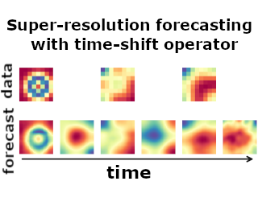

# Shifting Time: Time-series Forecasting with Khatri-Rao Neural Operators
Code repository for the ICML 2025 paper '[Shifting Time: Time-series Forecasting with Khatri-Rao Neural Operators](https://openreview.net/pdf?id=emkdmORaj4)' by Srinath Dama, Kevin Course, and Prasanth B. Nair.

<p align="center">
  
</p>

## Index

1. [Installation](#1-installation)
2. [Usage](#2-usage)
3. [Running numerical studies](#3-running-numerical-studies)
4. [Datasets](#4-datasets)
5. [Reference](#5-reference)

## 1. Installation

#### Installing dependencies:

```bash
conda create --name KRNO_env python=3.10

conda install numpy==1.26.2 scipy matplotlib seaborn h5py

conda install -c conda-forge pandas scikit-learn patool tqdm sktime wandb cartopy

conda install pytorch==2.1.1 pytorch-cuda=11.8 -c pytorch -c nvidia

pip install neuraloperator==0.3.0 torch-harmonics==0.6.5
```


#### Installing KRNO

After installing the dependencies, please follow the following steps to install KRNO

1. Clone the GitHub repository
```bash
git clone git@github.com:srinathdama/ShiftingTime.git
```

2. Install KRNO  
```bash
cd ShiftingTime/krno/ && pip install .
```


## 2. Usage

Following code snippets show how to use KRNO for both **temporal** and **spatio-temporal problems**. You can find this code in the [usage_tutorial.ipynb](usage_tutorial.ipynb) Jupyter Notebook.

### a. Temporal problems 

``` python
import torch
from torch import nn

from khatriraonop import models, quadrature

# ---------------------------------------------------------------------------------
# setting up the model grid
# dimensionality of the input domain
d = 1 # [t]

# Helper method to initialize 
# KRNO model with default configuration 
model = models.KhatriRaoNO_v2.easy_init(
    d,  # dimensionality of the input domain
    in_channels=2,          #  #input channels 
    out_channels=2,         #  #output channels 
    lifting_channels=128,   #  #lifting channels
    integral_channels=20,   #  #channels in each integral layer
    n_integral_layers=3,    #  #KRNO integral layers
    projection_channels=128,#  #projection channels
    n_hidden_units=32,      #  #hidden units in each layer of neural network parametrizing component-wise kernel
    n_hidden_layers=3,      # #hidden layers in neural network parametrizing component-wise kernel
    nonlinearity=nn.SiLU(), # Activation function
)

# 5 time instances in the past time-window  [0, 0.5)
past_times    = torch.tensor([0.03, 0.12, 0.18, 0.31, 0.45])

# predict at 7 time instances in the future time-window  [0.5, 1]
predict_times = torch.tensor([0.53, 0.67, 0.74, 0.79, 0.86, 0.9, 0.98])

# generating some dummy input data
batch_size = 8

u = torch.randn(batch_size, 5, 2)  # (BS, N, C), N is #time-steps, C is #channels
print('input shape:', u.shape)
# input shape: torch.Size([8, 5, 2])

# Compute input and output quadrature grids based on past_times and predict_times
quad_grid_in  = quadrature.trapezoidal_vecs_uneven(past_times)
quad_grid_out = quadrature.trapezoidal_vecs_uneven(predict_times)
in_grid       = ([quad_grid_in[0]], [quad_grid_in[1]]) 
out_grid      = ([quad_grid_out[0]], [quad_grid_out[1]])

# transform u -> v
v = model.super_resolution(out_grid, in_grid, u)
print('ouput shape:', v.shape)
# ouput shape: torch.Size([8, 7, 2])
```

### b. Spatio-temporal problems 

``` python
import torch
from torch import nn

from khatriraonop import models, quadrature

# ---------------------------------------------------------------------------------
# 2D spatio-temporal problem 

# example: shallow water problem
# dimensionality of the input domain
d = 3 # [t, x, y]
lag = 5 # #time-steps
Sx = 32 # x resolution
Sy = 32 # y resolution
Nc = 3 #\rho, u, v

# Helper method to initialize 
# KRNO model with default configuration 
model = models.KhatriRaoNO_v2.easy_init(
    d,  # dimensionality of the input domain
    in_channels=Nc,          #  \rho, u, v
    out_channels=Nc,         #  \rho, u, v
    lifting_channels=128,   #  #lifting channels
    integral_channels=20,   #  #channels in each integral layer
    n_integral_layers=3,    #  #KRNO integral layers
    projection_channels=128,#  #projection channels
    n_hidden_units=32,      #  #hidden units in each layer of neural network parametrizing component-wise kernel
    n_hidden_layers=3,      # #hidden layers in neural network parametrizing component-wise kernel
    nonlinearity=nn.SiLU(), # Activation function
)

# get computational grid
quad_fns = [
    quadrature.midpoint_vecs,
    quadrature.trapezoidal_vecs,
    quadrature.trapezoidal_vecs,
]

## Input grid 
in_grid = quadrature.get_quad_grid(
    quad_fns, [lag, Sx, Sy], [-1.0, -1.0, -1.0], [1.0, 1.0, 1.0]
)

## Output grid 
out_grid = quadrature.get_quad_grid(
    quad_fns, [lag, Sx, Sy], [-1.0, -1.0, -1.0], [1.0, 1.0, 1.0]
)

# generating some dummy input data
batch_size = 2

u = torch.randn(batch_size, lag, Sx, Sy, Nc)
print('input shape:', u.shape)
# input shape: torch.Size([2, 5, 32, 32, 3])

device = torch.device('cuda' if torch.cuda.is_available() else 'cpu')
print('Device:', device)
# Device: cuda

## moving to device
model = model.to(device)
u     = u.to(device)
out_grid = quadrature.quad_grid_to_device(out_grid, device)
in_grid  = quadrature.quad_grid_to_device(in_grid, device)

# transform u -> v
v = model.super_resolution(out_grid, in_grid, u)
print('ouput shape:', v.shape)
# ouput shape: torch.Size([2, 5, 32, 32, 3])
```

**Using lower-resolution quadrature grid in the intermediate integral layers.** 
This significantly decreases the memory and computational costs.

```python
quad_grid_latent = quadrature.get_quad_grid(
            quad_fns, [lag, int(Sx/2), int(Sy/2)], [-1.0, -1.0, -1.0], [1.0, 1.0, 1.0]
        )
latent_grid = quadrature.quad_grid_to_device(quad_grid_latent, device)

v = model.super_resolution(out_grid, in_grid, u, latent_grid=latent_grid)
print('ouput shape:', v.shape)
# ouput shape: torch.Size([2, 5, 32, 32, 3])
```

**Forecasting at super-resolution in both space and time**

```python 
## Output grid 
out_grid = quadrature.get_quad_grid(
    quad_fns, [4*lag, 4*Sx, 4*Sy], [-1.0, -1.0, -1.0], [1.0, 1.0, 1.0]
)
out_grid = quadrature.quad_grid_to_device(out_grid, device) # move grid to device

v = model.super_resolution(out_grid, in_grid, u, latent_grid=latent_grid)
print('ouput shape:', v.shape)
# ouput shape: torch.Size([2, 20, 128, 128, 3])
```

When `in_grid`,`latent_grid` and `out_grid` are same for training and inference, we can improves the performance of model by enabling the affine maps in the first and last integral layers.  

``` python

# Helper method to initialize 
# KRNO model 
model = models.KhatriRaoNO_v2.easy_init(
    d,  # dimensionality of the input domain
    in_channels=Nc,          #  \rho, u, v
    out_channels=Nc,         #  \rho, u, v
    lifting_channels=128,   #  #lifting channels
    integral_channels=20,   #  #channels in each integral layer
    n_integral_layers=3,    #  #KRNO integral layers
    projection_channels=128,#  #projection channels
    n_hidden_units=32,      #  #hidden units in each layer of neural network parametrizing component-wise kernel
    n_hidden_layers=3,      # #hidden layers in neural network parametrizing component-wise kernel
    nonlinearity=nn.SiLU(), # Activation function
)
model = model.to(device)

# when input and output grids are same 
cart_grid = quadrature.quad_to_cartesian_grid(in_grid)
cart_grid = quadrature.cart_grid_to_device(cart_grid, device) # move grid to device

v1         = model(cart_grid, u)
print('ouput shape:', v1.shape)
# ouput shape: torch.Size([2, 5, 32, 32, 3])
```

## 3. Running numerical studies

The scripts used for training and post-processing all the datasets are provided in the folder `experiments/scripts`.

#### A. Spatial and Spatio-temporal problems
- `experiments/scripts/darcy-flow/run_all.sh` contains the commands for training and testing using KRNO on Darcy flow dataset.
- In the case of **Hyper-Elastic**, **Shallow water**, and **Climate modeling** problems, `train_script.py` in the corresponding folders is used to train KRNO. Testing is done using the script `post_process.py`.

#### B. Temporal forecasting problems

**- Irregular time-series benchmarks**

-  Scripts `experiments/scripts/mujoco/run_all${i}.sh` are used for training KRNO on all MuJoCo datasets. We used the training pipeline and evaluation metric implemented by Oh, Y. et al. [1]  ([https://github.com/yongkyung-oh/Stable-Neural-SDEs](https://github.com/yongkyung-oh/Stable-Neural-SDEs)) 
- Scripts to train KRNO on MIMIC, USHCN, and Human Activity datasets are given in `experiments/scripts/irregular_time_series/krno`. We used the training pipeline and evaluation merics implemented  by Zhang, Weijia, et al. [2] ([https://github.com/usail-hkust/t-PatchGNN](https://github.com/usail-hkust/t-PatchGNN)). Instructions to download these datasets are also provided in their github page.  
- Training scripts for spiral trajectory (short and long) are provided in `experiments/scripts/spiral`. 

**- Regular time-series benchmarks**

- `experiments/scripts/darts/run_darts_KRNO.sh` contains the commands for hyperparameter tuning and testing using KRNO on all the **Darts** datasets. Final testing results for each dataset is written to the test file 'outputs/KRNO/*<dataset*>/final_test_results.txt' along with intermediate results from hyperparameter studies. 
- `experiments/scripts/m4_crypto_traj/run_crypto_KRNO.sh` contains the commands for hyperparameter tuning and testing using KRNO on all the **Crypto** test cases.
- `experiments/scripts/m4_crypto_traj/run_traj_KRNO.sh` contains the commands for hyperparameter tuning and testing using KRNO on all the **Player Trajectory** datasets.  
- `experiments/scripts/m4_crypto_traj/run_m4_KRNO.sh` contains the commands for hyperparameter tuning and testing using KRNO on all the **M4** test cases.  

[1] Oh, Y., Lim, D., & Kim, S. (2024, May). Stable Neural Stochastic Differential Equations in Analyzing Irregular Time Series Data. In The Twelfth International Conference on Learning Representations

[2] Zhang, Weijia, et al. "Irregular multivariate time series forecasting: A transformable patching graph neural networks approach." ICML 2024.

## 4. Datasets

- The datasets for the Darcy, Hyper-elasticity, and climate modeling are already included in the corresponding scripts folders. 
- Dataset for shallow water problem can be downloaded from [LOCA github page](https://github.com/PredictiveIntelligenceLab/LOCA?tab=readme-ov-file). Copy the downloaded npz files to the folder `experiments/scripts/shallow_water_<model>/loca-data/`.
- Darts datasets are included in the folder `experiments/dataset/darts`
- Instructions to download the datasets for M4, Crypto and Player Trajectory are given in `experiments/dataset/ReadMe.md`. 


## 5. Reference


Dama, Srinath, Kevin Course, and Prasanth B. Nair. "Shifting Time: Time-series Forecasting with Khatri-Rao Neural Operators." ICML 2025.


